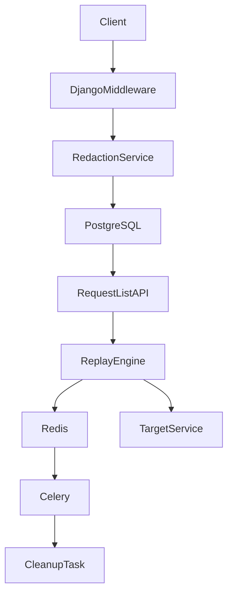

# Traceback API Debugger

## Project Overview

Traceback is a backend-focused API request replay and debugging platform for internal services. It captures incoming requests, stores safe metadata, redacts sensitive values, and allows developers to replay captured traffic against a configured target service.

## Problem

When an API fails in production or staging, the original request context is often lost. Developers may need to remember the endpoint, method, query string, status codes, body, headers, and latency. This project stores that data in a structured way and lets the team replay it safely.

## Why this exists

The platform is meant to be a lightweight internal debugging tool. It prioritizes safe capture, targeted replay, and practical data retention over a large dashboard or generic CRUD experience.

## Architecture



## Request lifecycle

1. Client sends an API request with an X-Traceback-Key header.
2. Django middleware identifies the project and generates a request ID.
3. The request is processed by the application.
4. The middleware captures request and response metadata.
5. Sensitive headers and body keys are redacted before storage.
6. The request appears in the debugging APIs for search and detail inspection.
7. Developers can replay the request against a configured target URL.
8. Results are stored, compared, and listed in replay history.

## Database design

The main data entities are:

- Project: stores project metadata and the API key used for identifying traffic.
- CapturedRequest: stores the original request, response, latency, request IDs, and retention metadata.
- Replay: stores a replay attempt, status, result code, body, timing, and idempotency key.

## Security considerations

- API keys are hashed before storage.
- Sensitive headers and JSON keys are redacted.
- Replay URLs are constrained to a configured target base URL.
- DELETE replays are blocked by default.
- Raw secrets are never logged.
- Request bodies are truncated once they exceed the configured size limit.

## Replay safety

Replay only targets a safe project-specific base URL. The system blocks arbitrary URL construction and prevents unsafe methods from replaying without confirmation. This avoids SSRF and accidental destructive replays.

## Redis usage

Redis is used for short-lived rate limiting and coordination. Replay and ingestion requests are protected with per-project request buckets so that a project cannot flood the tool or re-trigger the same operation repeatedly.

## Celery usage

Celery is used for asynchronous cleanup and background work that does not need to block the request thread. Cleanup jobs remove expired captured requests and their related data.

## API endpoints

- POST /api/projects/create/
- GET /api/projects/
- GET /api/requests/
- GET /api/requests/<id>/
- POST /api/requests/<id>/replay/
- GET /api/requests/<id>/replays/
- GET /api/schema/
- GET /api/docs/

## Local setup

1. Create and activate a virtual environment.
2. Install dependencies with pip.
3. Set USE_SQLITE=1 for local development.
4. Run python manage.py migrate.
5. Start the Django process with python manage.py runserver.

## Docker setup

The project is designed to run with Docker Compose.

```bash
docker compose up --build
```

## Running tests

```bash
python -m pytest
```

## Example workflow

1. Create a project.
2. Request a project API key.
3. Send a request with X-Traceback-Key.
4. Inspect the request in the list and detail APIs.
5. Replay the request against a safe target.
6. Compare original and replayed response payloads.

## Known limitations

- The project keeps replay logic intentionally simple and safe.
- Plain-text payload parsing is limited to basic detection and truncation rather than full universal redaction.
- Local development uses SQLite by default to make it easier to run in the editor.

## Future improvements

- More advanced diffing for nested JSON payloads.
- Better admin auth and developer-specific API keys.
- More precise retention policies per project.
- More robust exclusion rules for internal endpoints.
